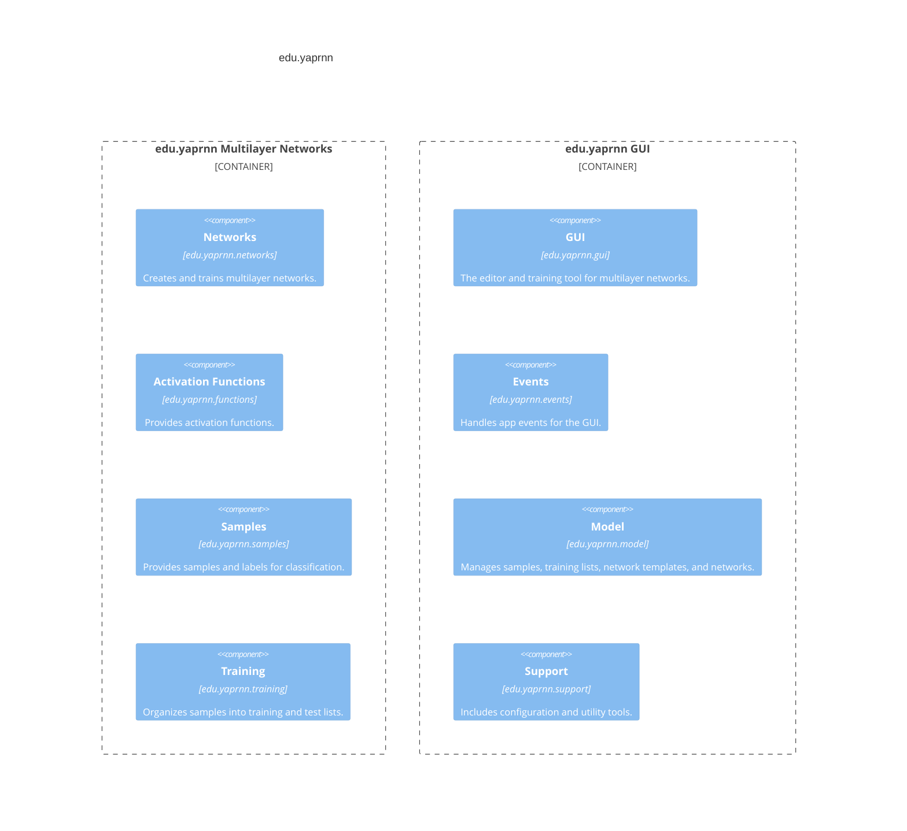

# ***edu.yaprnn***, formerly ***Yet Another Pattern Recognizing Neural Network***

Multilayer Networks (MLN) are easy to understand but need deep machine learning knowledge to master.
The `edu.yaprnn` app helps you learn MLNs by letting you experiment with sample data, network
settings, and training parameters.

In the app, you create and train MLNs using MNIST digit images and vocal sound files.

Our team of 5-6 students developed the original version for a machine learning course years ago. I
updated it to fix old issues. The original version is at
the [yaprnn repository](https://code.google.com/archive/p/yaprnn/), and a minimally fixed version is
on the `old-yaprnn` branch in this repository.

## How to use

* Have a Java 21+ distribution installed, e.g. [Eclipse Adoptium](https://adoptium.net/).
* Exec `gradlew run` on a terminal to run the java application.

###                           

### Load samples

### Create training set

### Create network template

### Create network

### Train network

### Classify

## Organization of the Code

The app is divided into two sets of packages. Most of it is for the GUI, found
in `gui`, `events`, `model`, and `support`. If you're interested in the MLN code, check out
the `networks` package and the related `functions`, `samples`, and `training` packages.

## License and attributions

`edu.yaprnn` is published
under [Creative Commons 4.0 (CC BY-NC)](https://creativecommons.org/licenses/). It uses open source
software published under multiple different licenses.

The repository contains the [MNIST database](https://paperswithcode.com/dataset/mnist), which
consists of 60.000 digit samples.

Attributions for [flaticon](https://www.flaticon.com/free-icons/layers) graphics:

- [Buandesign](https://www.flaticon.com/authors/buandesign)
- [Mayor Icons](https://www.flaticon.com/authors/mayor-icons)
- [Vectorslab](https://www.flaticon.com/authors/vectorslab)
- [srip](https://www.flaticon.com/authors/srip)
- [afif fudin](https://www.flaticon.com/authors/afif-fudin)
